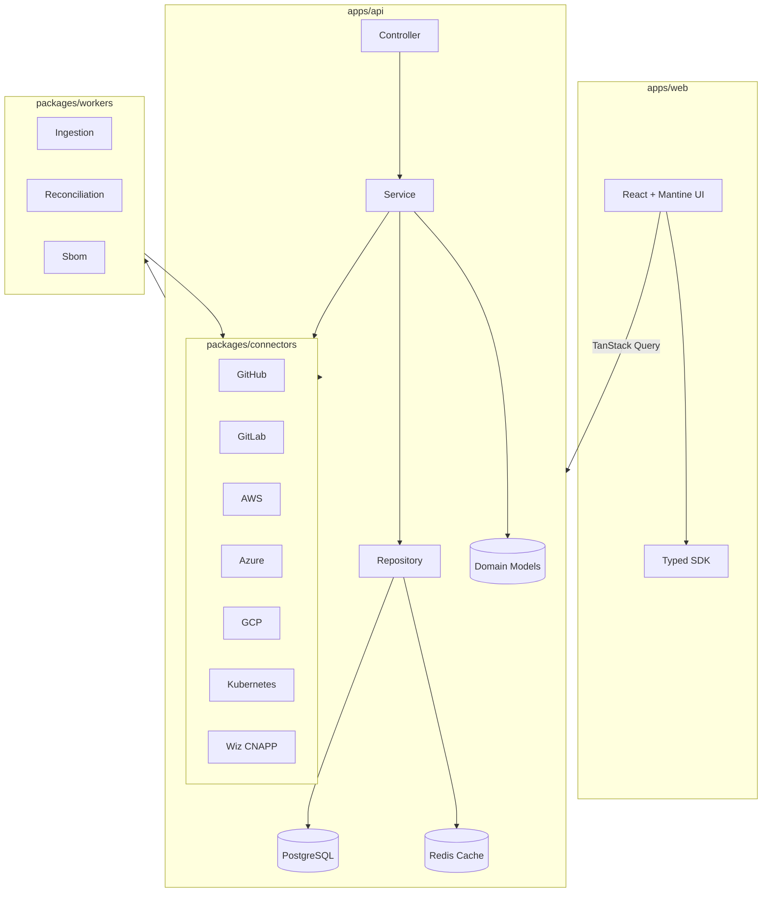

# Architecture Overview

The platform follows 12-factor app principles with a clean architecture approach:

- **Presentation layer**: React SPA communicating with the API via the generated SDK.
- **Application layer**: Express-based services orchestrating use-cases and cross-cutting concerns.
- **Domain layer**: Rich TypeScript entities/value objects shared between the API and background workers.
- **Infrastructure layer**: Prisma repositories, connector adapters, and external integrations (SCM, CI/CD, cloud providers, CNAPP).

Key quality attributes include security-first design, observability (logs, metrics, traces), and modular connector interfaces for pluggability.
