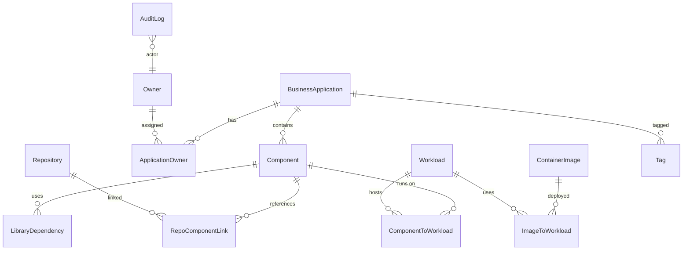

# Data Model

The domain is persisted via PostgreSQL using Prisma. Entities are structured to support soft deletion, auditability, and provenance of reconciled links.

See [`apps/api/prisma/schema.prisma`](../apps/api/prisma/schema.prisma) for the authoritative schema and field-level documentation.
