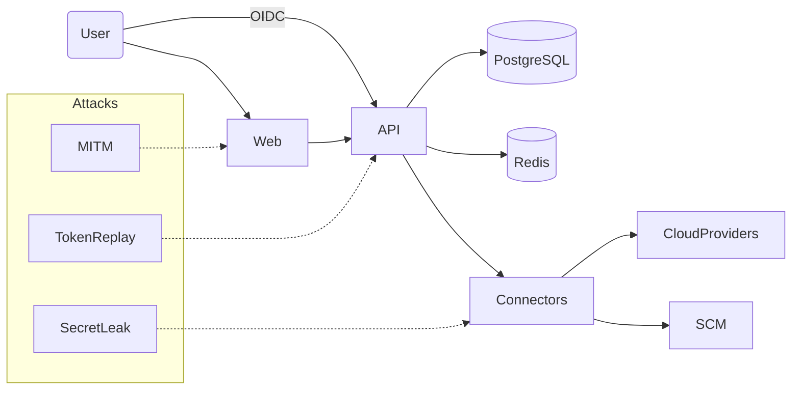

# Security & Privacy

## Authentication & Authorization

- OIDC login with configurable issuer (Auth0, Okta, Entra ID).
- RBAC roles (admin, editor, viewer) combined with attribute-based filters (cloud accounts, business units).
- Signed webhook and CI ingestion endpoints using per-tenant HMAC secrets.

## Data Protection

- Secrets provided via environment variables and injected at runtime (12-factor).
- Prisma soft-delete fields and audit trail provide tamper awareness.
- Demo mode anonymises PII for demos and screenshots.

## Threat Model

Mitigations include TLS everywhere, JWT audience/issuer validation, connector least-privilege IAM roles, and comprehensive audit logging.

## Compliance

- GDPR & CCPA readiness via right-to-erasure tooling and minimal data retention.
- SOC 2 controls supported through logging, configuration management, and incident response runbooks.
